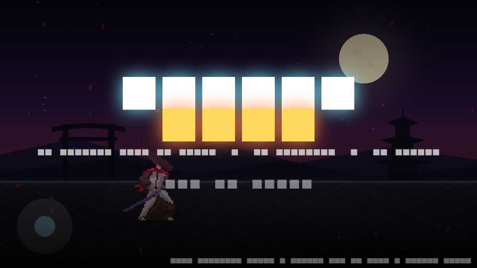
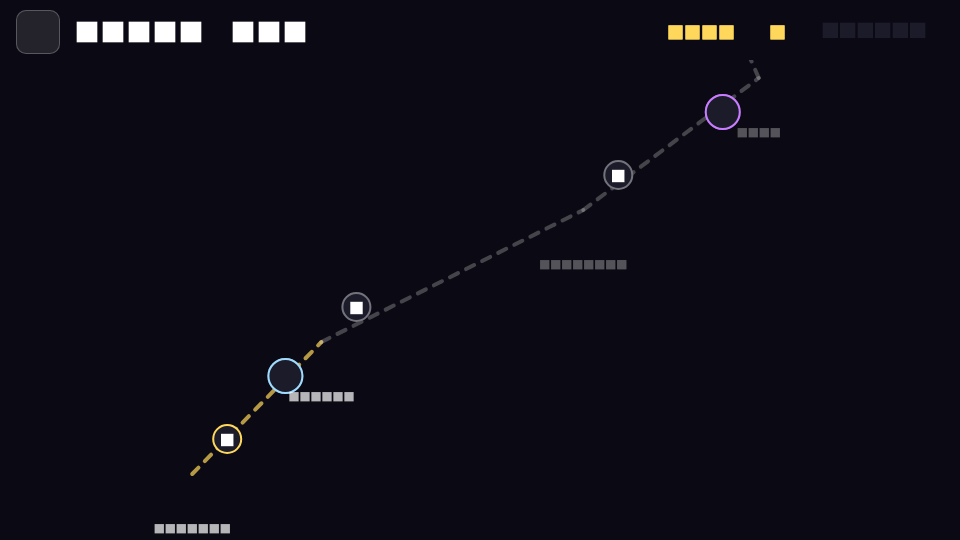
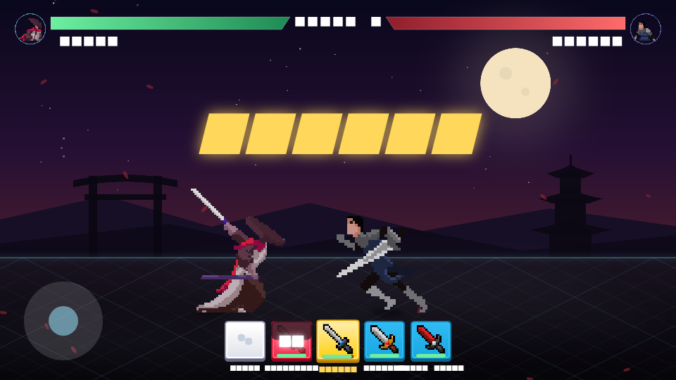
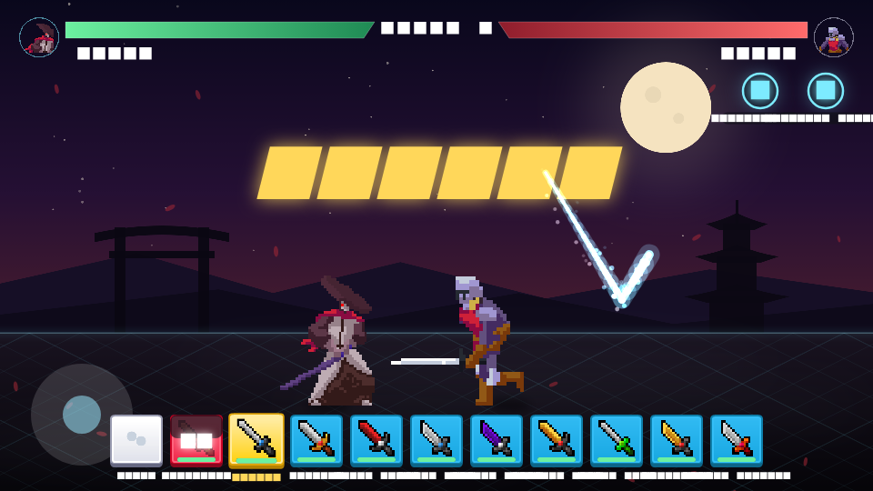
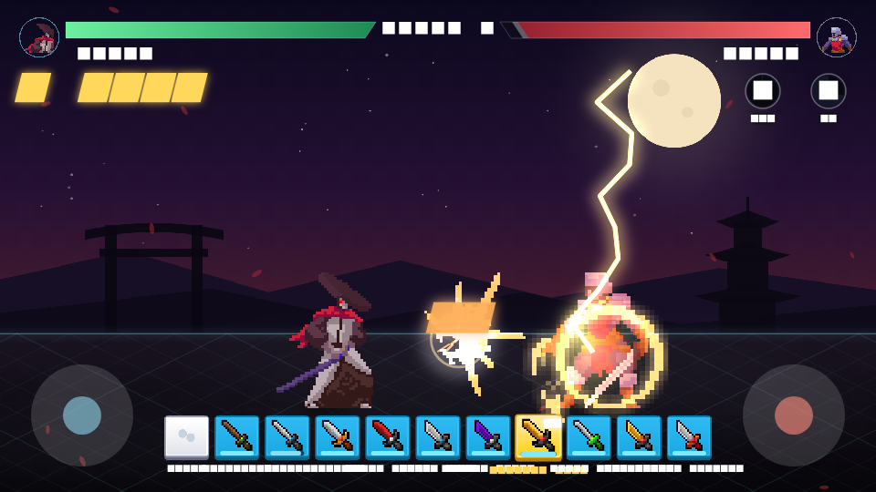
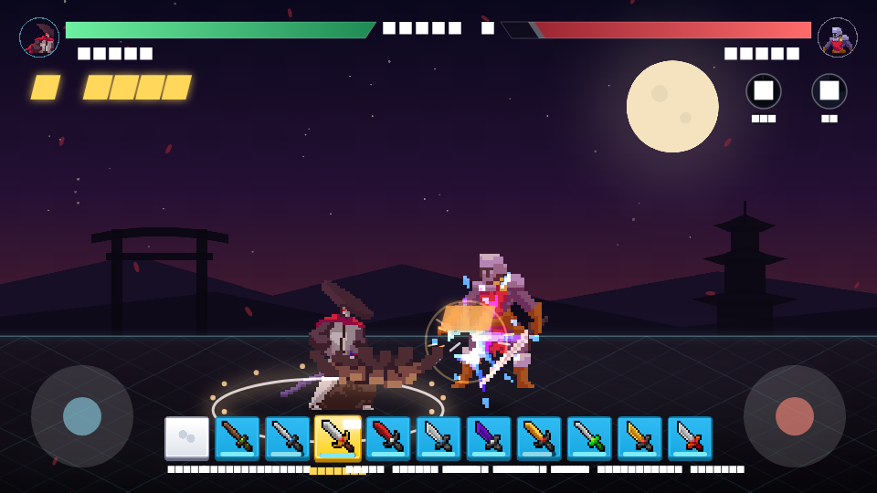

# Shadow Duel

An endless isometric sword-fighting campaign built with Flutter + Flame, using
free CC0 / CC BY pixel-art packs downloaded from itch.io and Kenney (see
[CREDITS.md](CREDITS.md)).

| Title | Stage map | Battle |
| --- | --- | --- |
|  |  |  |

## Run

```sh
flutter run            # pick a device; landscape is enforced on mobile
```

## Flow

**Title → endless stage map → battle → result → next stage.** The map winds
upward forever; every stage pits Kaito against the next of 14 villains, and
each lap through the roster raises the tier (more HP, damage, aggression).
Progress (highest stage cleared) is saved on the device.

## Sword arts (draw glyphs)

Every stroke on the right half of the screen leaves a glowing sword trail.
Draw a **V** or a **W** and the equipped blade answers with its own **Art**;
the glyph flashes with the art's name, and cooldown badges (V / W) sit under
the enemy's health bar. Each of the ten swords has two arts, listed in the
Armory under its stats:

| Blade | V (offense) | W (defense / utility) |
| --- | --- | --- |
| Fists | Flurry — three fast punches | Breathe — heal 8 |
| Wakizashi | Flash Step — dash through with three cuts | Second Wind — heal 15% |
| Katana | Crescent Cut — slash wave that bleeds | Iaijutsu Stance — untouchable 1.5s, next hit crits |
| Nodachi | Earthsplitter — shockwave, launch + stun | Iron Will — 70% less damage for 5s |
| Flame Blade | Fire Wave — burning wave | Blazing Aura — heal 10, attackers burn |
| Frost Edge | Glacial Lance — freezing lance | Ice Armor — shield absorbs 30 |
| Shadow Blade | Shadow Strike — teleport behind, headshot | Veil — untouchable and ignored 3s |
| Thunder Fang | Thunderclap — lightning, stun | Storm Charge — 40% faster swings 6s |
| Venom Kris | Toxic Fang — heavy poison | Antidote — cleanse, heal 20 |
| Excalibur | Holy Lance — launching lance of light | Sanctuary — invincible 3s, heal 25 |
| Dragon Cleaver | Dragon's Breath — fire cone | Draconic Rage — +60% damage, lifesteal 6s |

Art strikes are unblockable and never wear the blade. Each blade keeps its own
V and W timers, and after any art every art locks for 4s, so switching cards
can't chain a whole deck into one burst. You can't cast while staggered.
Six villains inflict status effects of their own (Seraph and King Varin bleed,
Lyra and Malakar poison, Ignis burns, Zephyr chills), which Antidote and
Sanctuary answer. Hits land with pimen's pixel VFX (hit sparks, smears, fire,
thunder, ice, holy, earth) on top of the game's own trails, shockwaves,
lightning and dash after-images.

| Trail | Thunderclap | Earthsplitter |
| --- | --- | --- |
|  |  |  |

## Controls

| Input | Action |
| --- | --- |
| Left stick | Move on the isometric floor (x + depth) |
| Right stick · flick ▲ | Head cut — headshots often, beaten by a high guard |
| Right stick · flick ▼ | Low sweep at the feet — trips through a high guard |
| Right stick · flick ◄ ► | Body slash |
| Right stick · tap | Quick strike |
| **Both sticks ▲** | Skull smash — unblockable, guaranteed headshot |
| Draw **V** / **W** in the middle of the screen | Sword art (V offense, W defense) |
| Stand still | High guard: head and body covered, feet open |
| Card bar | Tap a sword card to draw it |

Villains guard too: a **GUARD ▲** marker means the head and body are covered
(go low), **GUARD ▼** means the feet and body are (go high). Heavy blows and
sword arts ignore guards.

The finger path is never drawn; when a glyph is read, a clean V or W emblem
bursts where you drew it with the art's name.

## Sword cards

Every owned sword is a card in the bar. A drawn blade can be used for a short
**active** window (7–14 s) that drains while it's in your hand; when it runs
out the blade is **spent** and rests for a long **recharge** (30–60 s), and
the next ready card is drawn — or you fight bare-handed. Putting a card away
keeps its remaining time. The Armory lists each blade's active and recharge
times with its stats and both arts.

## Sound

Chiptune music (menu / battle) and effects for every swing, hit, block,
headshot, KO, card, art and screen — see [CREDITS.md](CREDITS.md). Audio is
silent under `flutter test`.

## Assets

- `assets/images/packs/<pack>/` — 15 downloaded LuizMelo character packs
  (spaces removed from filenames), each with its `License.txt` and a generated
  `portrait.png`
- `assets/images/swords/` — 10 sword icons (Kyrise)
- `assets/images/ui/` — Kenney card frames, buttons, map nodes, icons
- `assets/images/packs.json` — atlas written by the importer: frame sizes
  (non-square supported), feet anchors, scale, durations, facing, per-frame
  weapon-tip points for trails, and the game-animation → sheet mapping
- `assets/images/arena.png`, `meta.json` — the project's own arena backdrop
  and bare-hands icon

### Adding a character pack

1. Drop the pack's sprite strips into `assets/images/packs/<name>/`.
2. Add it to `PACKS` in `tool/import_packs.py` (on-screen height, portrait
   framing) and run `python3 tool/import_packs.py` — it auto-detects frame
   width, feet line, and facing, and maps Idle/Run/Attack*/Take Hit/Death.
3. List the folder under `assets:` in `pubspec.yaml` and add a `StageChar`
   to the roster in `lib/game/shadow_game.dart`.

## Code map

- `lib/game/shadow_game.dart` — game core: stages, roster, phases, card deck
  wiring, strike resolution and sword specials
- `lib/game/cards.dart` — card economy (durability, shatter, recharge, switch)
- `lib/game/weapons.dart` — the 10 swords, specials, move specs
- `lib/game/progress.dart` — saved progress (shared_preferences)
- `lib/game/sprites.dart` — atlas loader (`SpriteLibrary`)
- `lib/game/fighter.dart` — sprite-sheet fighter, combat state machine,
  status effects (bleed/burn/poison/freeze/shock)
- `lib/game/villain.dart` — villain AI
- `lib/game/hud.dart` — health bars, portraits, combo, card bar, gesture zone
- `lib/ui/screens.dart` — title, endless map, armory, result screens
- `tool/` — asset pipeline (pack importer, arena/icon baker); not compiled
  into the app
