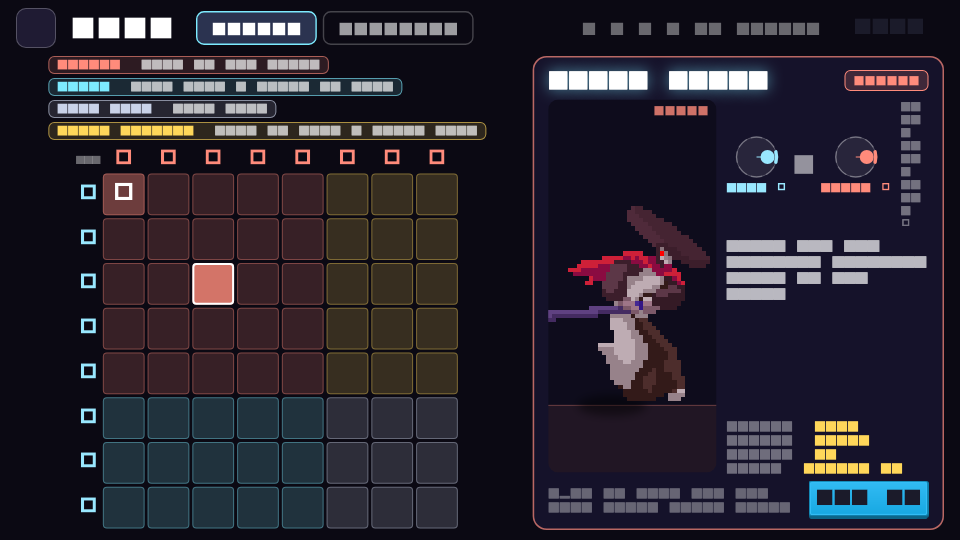
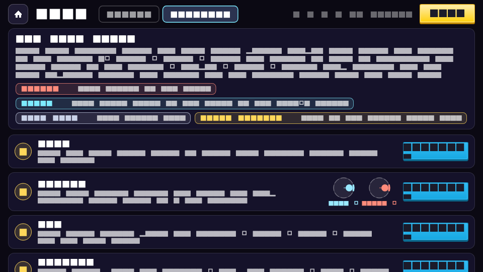

# Shadow Duel

An endless isometric sword-fighting campaign built with Flutter + Flame, using
free CC0 / CC BY pixel-art packs downloaded from itch.io and Kenney (see
[CREDITS.md](CREDITS.md)).

| Title | Stage map | Battle |
| --- | --- | --- |
|  |  |  |

## Run

```sh
flutter run            # pick a device; landscape is enforced on mobile
```

## Flow

**Title → endless stage map → battle → result → next stage.** The map winds
upward forever; every stage pits Kaito against the next of 14 villains, and
each lap through the roster raises the tier (more HP, damage, aggression).
Progress (highest stage cleared) is saved on the device.

## Sword arts (draw glyphs)

Every stroke on the right half of the screen leaves a glowing sword trail.
Draw a **V** or a **W** and the equipped blade answers with its own **Art**;
the glyph flashes with the art's name, and cooldown badges (V / W) sit under
the enemy's health bar. Each of the ten swords has two arts, listed in the
Armory under its stats:

| Blade | V (offense) | W (defense / utility) |
| --- | --- | --- |
| Fists | Flurry — three fast punches | Breathe — heal 8 |
| Wakizashi | Flash Step — dash through with three cuts | Second Wind — heal 15% |
| Katana | Crescent Cut — slash wave that bleeds | Iaijutsu Stance — untouchable 1.5s, next hit crits |
| Nodachi | Earthsplitter — shockwave, launch + stun | Iron Will — 70% less damage for 5s |
| Flame Blade | Fire Wave — burning wave | Blazing Aura — heal 10, attackers burn |
| Frost Edge | Glacial Lance — freezing lance | Ice Armor — shield absorbs 30 |
| Shadow Blade | Shadow Strike — teleport behind, headshot | Veil — untouchable and ignored 3s |
| Thunder Fang | Thunderclap — lightning, stun | Storm Charge — 40% faster swings 6s |
| Venom Kris | Toxic Fang — heavy poison | Antidote — cleanse, heal 20 |
| Excalibur | Holy Lance — launching lance of light | Sanctuary — invincible 3s, heal 25 |
| Dragon Cleaver | Dragon's Breath — fire cone | Draconic Rage — +60% damage, lifesteal 6s |

Art strikes are unblockable and cost none of the blade's time. Each blade keeps its own
V and W timers, and after any art every art locks for 4s, so switching cards
can't chain a whole deck into one burst. You can't cast while staggered.
Six villains inflict status effects of their own (Seraph and King Varin bleed,
Lyra and Malakar poison, Ignis burns, Zephyr chills), which Antidote and
Sanctuary answer. Hits land with pimen's pixel VFX (hit sparks, smears, fire,
thunder, ice, holy, earth) on top of the game's own trails, shockwaves,
lightning and dash after-images.

| Trail | Thunderclap | Earthsplitter |
| --- | --- | --- |
|  |  |  |

## Controls

| Input | Action |
| --- | --- |
| Left stick **alone** | Move on the isometric floor (x + depth) |
| **Both sticks held** | One of the 64 combos — see the table above |
| **Both ▲** | Skull smash — unblockable, guaranteed headshot, long recharge |
| Hold the pair | Repeat the stroke; releasing plays the recovery |
| Draw **V** / **W** in the middle of the screen | Sword art (V offense, W defense) |
| Card bar | Tap a sword card to draw it |

Directions are read **relative to the enemy**, so the same pair means the same
combo on either side of them, and a small hysteresis stops a thumb resting on a
sector boundary from flickering between two combos.

Villains guard too: a **GUARD ▲** marker means the head and body are covered
(go low), **GUARD ▼** means the feet and body are (go high). Heavy blows and
sword arts ignore guards.

The finger path is never drawn; when a glyph is read, a clean V or W emblem
bursts where you drew it with the art's name.

## Sword cards

Every owned sword is a card in the bar. A drawn blade can be used for a short
**active** window (7–14 s) that drains while it's in your hand; when it runs
out the blade is **spent** and rests for a long **recharge** (30–60 s), and
the next ready card is drawn — or you fight bare-handed. Putting a card away
keeps its remaining time. The Armory lists each blade's active and recharge
times with its stats and both arts.

## Two-stick combos (8 x 8 = 64)

Both sticks read the same eight sectors, **relative to the enemy** — so "forward"
is always toward them, whichever way you are facing. The pair you hold picks one
of 64 combos, and the rule is the one thing to learn:

| Left stick | Right stick | You |
| --- | --- | --- |
| toward | toward | **attack** — left picks the height, right picks the weapon |
| away | toward | **block** — right's height is the guard; diagonals **parry** |
| away | away | **step back**, guard up |
| toward | away | **guard advance** — close in behind the guard |

Left ▲ + right ▲ is the **skull smash**. Attacks split by the right stick: ▲ goes
aerial, ▼ kicks and sweeps, sideways swings the blade; the left stick's height
decides whether it lands on the head, body or feet.

**Hold to keep going.** Every combo has a wind-up, a repeating stroke and a
recovery. Holding it loops the stroke and each cycle is a fresh swing, so you can
spam one combo; switching to another plays the first one's exit and the new one's
entry, so transitions read as deliberate rather than snapping.

Blocks only turn blows aimed where you are covering — a high guard eats head cuts
and lets sweeps through. The angled guards are **parries**: they cover one exact
zone, take no damage at all, and stagger the attacker.

## The dojo

**DOJO** on the title screen opens a practice hall with two tabs.

| Combo board | Tutorial |
| --- | --- |
|  |  |

**COMBOS** is the whole 8 x 8 board, coloured by what each pair does. Tap any
cell to see that combo animate on a loop, with the exact sticks to hold, its
zone, guard, damage and reach. **TUTORIAL** walks the rules one lesson at a
time — moving, striking a zone, spamming a hold, blocking, parrying, stepping
back — each with a goal you finish against a sparring partner who never knocks
you out.

## Sound

Chiptune music (menu / battle) and effects for every swing, hit, block,
headshot, KO, card, art and screen — see [CREDITS.md](CREDITS.md). Audio is
silent under `flutter test`.
## Pausing and the star chase

Tap the **pause button** at the top of the battle screen to freeze the fight;
from there you can **resume** or **quit to the map** (quitting forfeits the
stage — it is not counted as cleared). Time also thickens slightly whenever
either fighter is one hit from going down.

Every cleared stage is scored out of **three stars**, shown on the map node
and on the victory card:

| Star | Earned by |
| --- | --- |
| ★ | clearing the stage |
| ★★ | finishing with at least half your health |
| ★★★ | landing an 8-hit combo |

Stars, your best combo and your furthest stage are saved on the device, so a
one-star clear is worth going back for.

## Continuous integration

`.github/workflows/ci.yml` runs on every push and pull request to `main`:

| Job | What it does |
| --- | --- |
| Analyze & test | `flutter analyze` + `flutter test` |
| Build Android | release APK **and** App Bundle, uploaded as artifacts |
| Build iOS | `flutter build ios --release --no-codesign`, `.app` uploaded |
| Build web | release web bundle (see caveat) |

**Android is the target to play on.** The web build is included for
convenience, but this game is designed around two thumbs on a touchscreen:

- On **desktop web** a mouse is a single pointer, so you cannot hold the left
  stick and flick the right one at the same time — the both-sticks **skull
  smash** is unreachable, and moving while attacking is not possible.
- Browsers block audio until the first user gesture, so music and hit sounds
  start late.
- The first load ships every sprite sheet, VFX strip and audio file, and the
  additive blends the effects rely on are slower under CanvasKit.

Mobile web works (multi-touch), but Android gets correct audio, full
performance and both sticks.

## Assets

- `assets/images/packs/<pack>/` — 15 downloaded LuizMelo character packs
  (spaces removed from filenames), each with its `License.txt` and a generated
  `portrait.png`
- `assets/images/swords/` — 10 sword icons (Kyrise)
- `assets/images/ui/` — Kenney card frames, buttons, map nodes, icons
- `assets/images/packs.json` — atlas written by the importer: frame sizes
  (non-square supported), feet anchors, scale, durations, facing, per-frame
  weapon-tip points for trails, and the game-animation → sheet mapping
- `assets/images/arena.png`, `meta.json` — the project's own arena backdrop
  and bare-hands icon

### Adding a character pack

1. Drop the pack's sprite strips into `assets/images/packs/<name>/`.
2. Add it to `PACKS` in `tool/import_packs.py` (on-screen height, portrait
   framing) and run `python3 tool/import_packs.py` — it auto-detects frame
   width, feet line, and facing, and maps Idle/Run/Attack*/Take Hit/Death.
3. List the folder under `assets:` in `pubspec.yaml` and add a `StageChar`
   to the roster in `lib/game/shadow_game.dart`.

## Code map

- `lib/game/shadow_game.dart` — game core: stages, roster, phases, card deck
  wiring, strike resolution and sword specials
- `lib/game/combos.dart` — the 64 two-stick combos: direction decoding, the
  attack/block/step-back/advance rule, per-combo clips and the clip player
- `lib/game/tutorial.dart` — dojo lessons and their goals
- `lib/game/cards.dart` — card economy (active window, spend, recharge, switch)
- `lib/game/weapons.dart` — the 10 swords, specials, move specs
- `lib/game/progress.dart` — saved progress: furthest stage, per-stage stars,
  best combo (shared_preferences)
- `lib/game/sprites.dart` — atlas loader (`SpriteLibrary`)
- `lib/game/fighter.dart` — sprite-sheet fighter, combat state machine,
  status effects (bleed/burn/poison/freeze/shock)
- `lib/game/villain.dart` — villain AI
- `lib/game/hud.dart` — health bars, portraits, combo, card bar, gesture zone
- `lib/ui/screens.dart` — title, endless map, armory (blade rack + display
  case), pause menu, result screens
- `lib/ui/dojo.dart` — the dojo: 8 x 8 combo board with animated previews, and
  the tutorial lessons
- `docs/combos.json` — every combo dumped by `tool/dump_combos.dart`
- `tool/` — asset pipeline (pack importer, arena/icon baker); not compiled
  into the app
